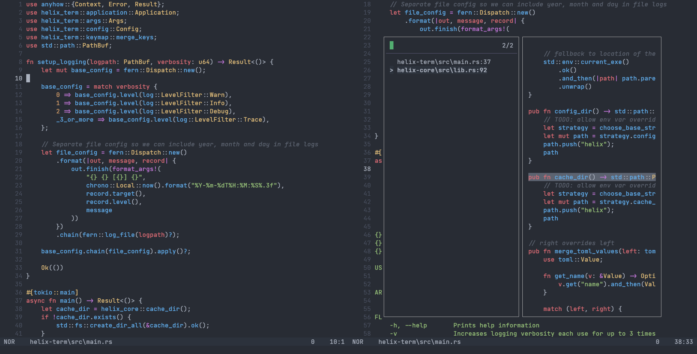

<div align="center">

<h1>
<picture>
  <source media="(prefers-color-scheme: dark)" srcset="logo_dark.svg">
  <source media="(prefers-color-scheme: light)" srcset="logo_light.svg">
  
</picture>
</h1>

[](https://github.com/helix-editor/helix/actions)
[](https://github.com/helix-editor/helix/releases/latest)
[](https://docs.helix-editor.com/)
[](https://github.com/helix-editor/helix/graphs/contributors)
[](https://matrix.to/#/#helix-community:matrix.org)

</div>



A Kakoune / Neovim inspired editor, written in Rust.

The editing model is very heavily based on Kakoune; during development I found
myself agreeing with most of Kakoune's design decisions.

For more information, see the [website](https://helix-editor.com) or
[documentation](https://docs.helix-editor.com/).

All shortcuts/keymaps can be found [in the documentation on the website](https://docs.helix-editor.com/keymap.html).

[Troubleshooting](https://github.com/helix-editor/helix/wiki/Troubleshooting)

# Features

- Vim-like modal editing
- Multiple selections
- Built-in language server support
- Smart, incremental syntax highlighting and code editing via tree-sitter

It's a terminal-based editor first, but I'd like to explore a custom renderer
(similar to Emacs) in wgpu or skulpin.

Note: Only certain languages have indentation definitions at the moment. Check
`runtime/queries/<lang>/` for `indents.scm`.

# Installation

Packages are available for various distributions (see [Installation docs](https://docs.helix-editor.com/install.html)).

If you would like to build from source:

```shell
git clone https://github.com/helix-editor/helix
cd helix
cargo install --path helix-term
```

This will install the `hx` binary to `$HOME/.cargo/bin` and build tree-sitter grammars in `./runtime/grammars`.

Helix needs its runtime files so make sure to copy/symlink the `runtime/` directory into the
config directory (for example `~/.config/helix/runtime` on Linux/macOS, or `%AppData%/helix/runtime` on Windows).

| OS                   | Command                                          |
| -------------------- | ------------------------------------------------ |
| Windows (Cmd)        | `xcopy /e /i runtime %AppData%\helix\runtime`    |
| Windows (PowerShell) | `xcopy /e /i runtime $Env:AppData\helix\runtime` |
| Linux / macOS        | `ln -s $PWD/runtime ~/.config/helix/runtime`     |

Starting with Windows Vista you can also create symbolic links on Windows. Note that this requires
elevated privileges - i.e. PowerShell or Cmd must be run as administrator.

**PowerShell:**

```powershell
New-Item -ItemType SymbolicLink -Target "runtime" -Path "$Env:AppData\helix\runtime"
```

**Cmd:**

```cmd
cd %appdata%\helix
mklink /D runtime "<helix-repo>\runtime"
```

The runtime location can be overridden via the `HELIX_RUNTIME` environment variable.

> NOTE: if `HELIX_RUNTIME` is set prior to calling `cargo install --path helix-term`,
> tree-sitter grammars will be built in `$HELIX_RUNTIME/grammars`.

If you plan on keeping the repo locally, an alternative to copying/symlinking
runtime files is to set `HELIX_RUNTIME=/path/to/helix/runtime`
(`HELIX_RUNTIME=$PWD/runtime` if you're in the helix repo directory).

Packages already solve this for you by wrapping the `hx` binary with a wrapper
that sets the variable to the install dir.

> NOTE: running via cargo also doesn't require setting explicit `HELIX_RUNTIME` path, it will automatically
> detect the `runtime` directory in the project root.

If you want to customize your `languages.toml` config,
tree-sitter grammars may be manually fetched and built with `hx --grammar fetch` and `hx --grammar build`.

In order to use LSP features like auto-complete, you will need to
[install the appropriate Language Server](https://github.com/helix-editor/helix/wiki/How-to-install-the-default-language-servers)
for a language.

[](https://repology.org/project/helix/versions)

## Adding Helix to your desktop environment

If installing from source, to use Helix in desktop environments that supports [XDG desktop menu](https://specifications.freedesktop.org/menu-spec/menu-spec-latest.html), including Gnome and KDE, copy the provided `.desktop` file to the correct folder:

```bash
cp contrib/Helix.desktop ~/.local/share/applications
```

To use another terminal than the default, you will need to modify the `.desktop` file. For example, to use `kitty`:

```bash
sed -i "s|Exec=hx %F|Exec=kitty hx %F|g" ~/.local/share/applications/Helix.desktop
sed -i "s|Terminal=true|Terminal=false|g" ~/.local/share/applications/Helix.desktop
```

Please note: there is no icon for Helix yet, so the system default will be used.

## macOS

Helix can be installed on macOS through homebrew:

```
brew install helix
```

# Contributing

Contributing guidelines can be found [here](./docs/CONTRIBUTING.md).

# Getting help

Your question might already be answered on the [FAQ](https://github.com/helix-editor/helix/wiki/FAQ).

Discuss the project on the community [Matrix Space](https://matrix.to/#/#helix-community:matrix.org) (make sure to join `#helix-editor:matrix.org` if you're on a client that doesn't support Matrix Spaces yet).

# Credits

Thanks to [@JakeHL](https://github.com/JakeHL) for designing the logo!
