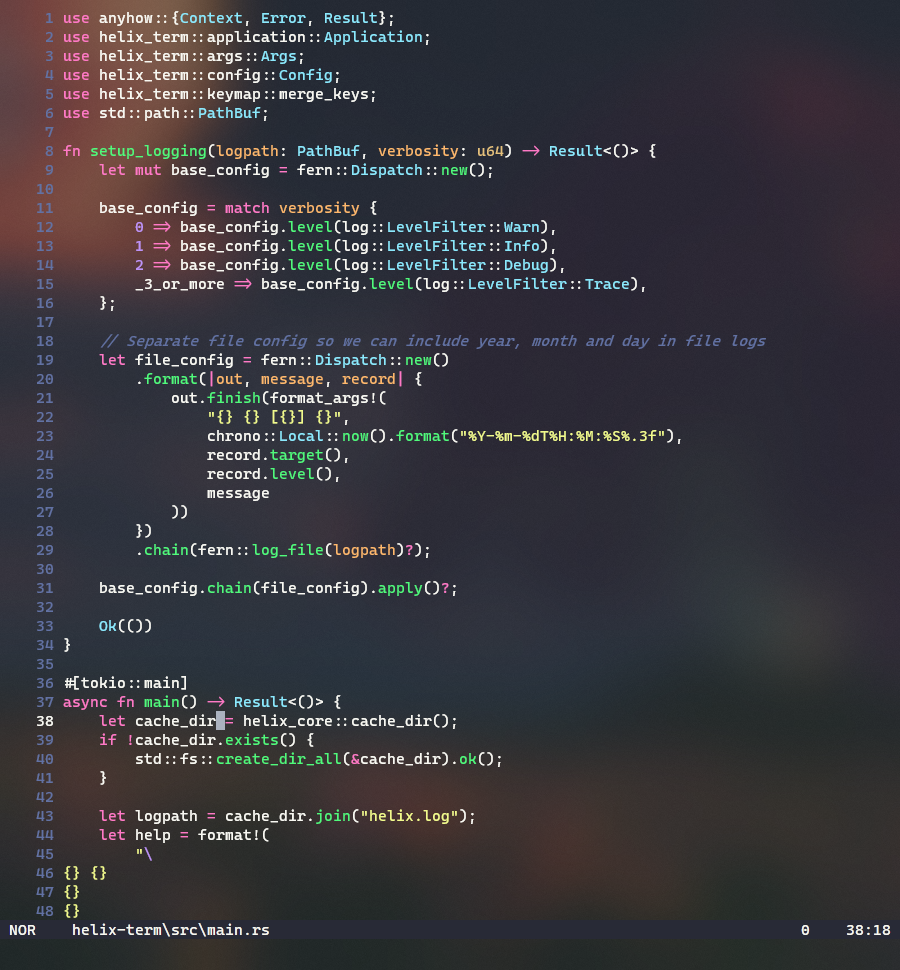
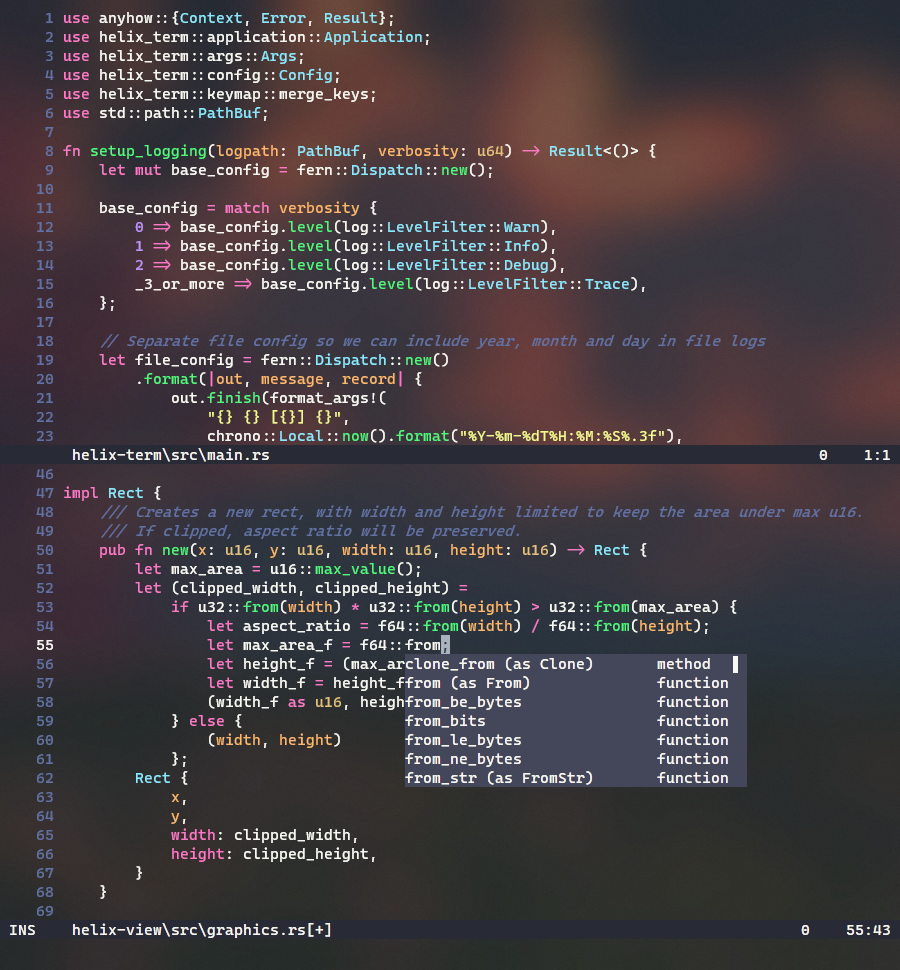

<h1 align="center" style="font-size: 55px">Helix</h1>
<p align="center" style="font-size: 30px">A kakoune / neovim inspired editor, written in Rust.</p>

<div align="center" style="display:inline">
      
      
</div>

[](https://github.com/helix-editor/helix/actions)
[](https://img.shields.io/matrix/helix-community:matrix.org)
[](https://github.com/helix-editor/helix/stargazers)
[](#)
[](./LICENSE)

The editing model is very heavily based on kakoune; during development I found
myself agreeing with most of kakoune's design decisions. For more information, see the [website](https://helix-editor.com) or
[documentation](https://docs.helix-editor.com/).

All shortcuts/keymaps can be found [on the website](https://docs.helix-editor.com/keymap.html).

## ✨ Features

- Vim-like modal editing
- Multiple selections
- Built-in language server support
- Smart, incremental syntax highlighting and code editing via tree-sitter

It's a terminal-based editor first, but I'd like to explore a custom renderer
(similar to emacs) in wgpu or skulpin. See [#39](https://github.com/helix-editor/helix/issues/39) for more info.

## 📦 Installation

> Note: Installing from source requires extra configuration for syntax highlighting and themes to work. See [runtime](#runtime).

#### Binary (All Platforms)

Pre-build binaries are available in the [releases page](https://github.com/helix-editor/helix/releases).

#### Linux

Download via a package:

[](https://repology.org/project/helix/versions)

#### macOS

Helix can be installed on MacOS through homebrew:

```
brew tap helix-editor/helix
brew install helix
```

#### From Source

```
git clone --recurse-submodules --shallow-submodules -j8 https://github.com/helix-editor/helix
cd helix
cargo install --path helix-term
```

This will install the `hx` binary to `$HOME/.cargo/bin`.

#### Runtime

> Note: Installing runtime is not required for linux packages or binaries.

Helix requires extra files for syntax highlighting and themes. To install, copy the `runtime/` folder included with binary or source, to the directory bellow.

| OS            | Path                  |
| ------------- | --------------------- |
| Linux & MacOS | ~/.config/helix/      |
| Windows       | Appdata/Roaming/Helix |

For example: `~/.config/helix/runtime`

#### Notes

The runtime directory can be overriden via the `HELIX_RUNTIME` environment variable.

Running via cargo also doesn't require setting explicit `HELIX_RUNTIME` path, it will automatically
detect the `runtime` directory in the project root.

Setting up runtime is not required for linux. Packages wrap the `hx` binary
with a wrapper that sets HELIX_RUNTIME to the install directory.

## 📚 Documentation

- [FAQ](https://github.com/helix-editor/helix/wiki/FAQ)
- [Screenshots](https://github.com/helix-editor/helix/wiki/Themes)
- [Helix Website](https://helix-editor.com/)
  - [Documentation](https://docs.helix-editor.com/)
  - [Basic Usage](https://docs.helix-editor.com/usage.html)
  - [Keymappings](https://docs.helix-editor.com/keymap.html)
  - [Configuration](https://docs.helix-editor.com/configuration.html)
  - [Themes](https://docs.helix-editor.com/themes.html)
  - [Migrating from Vim](https://docs.helix-editor.com/from-vim.html)

## 🛠️ Troubleshooting

#### Missing syntax highlighting and themes?

Follow the steps in the [install guide](#runtime) to setup your runtime.

#### Indentation not working?

Only certain languages have indentation definitions at the moment. Check
[runtime/queries/\<lang>/](./runtime/queries/) for `indents.toml`

#### LSP not working?

Is the LSP server (E.g. `rust-analyzer`) in your `$PATH`?

Try starting helix with the `-v` flag and checking the log file (`~/.cache/helix/helix.log`) for LSP related messages.

#### Failed to execute C compiler (building from source)

Both a C and a C++ compiler need to be installed.

## ❤️ Contributing ️

Contributors are very welcome! **No contribution is too small and all contributions are valued!**

Some suggestions to get started:

- You can look at the [good first issue](https://github.com/helix-editor/helix/labels/E-easy) label on the issue tracker.
- Help with packaging on various distributions needed!
- To use print debugging to the `~/.cache/helix/helix.log` file, you must:
  - Print using `log::info!`, `warn!`, or `error!`. (`log::info!("helix!")`)
  - Use the parameter (`hx -v <file>`) to increase log verbosity. Increase the `v's` for more info, `hx -vvv` being most verbose.
- If your preferred language is missing, integrating a tree-sitter grammar for
  it and defining syntax highlight queries for it is straight forward and
  doesn't require much knowledge of the internals.

We provide an [architecture.md](./docs/architecture.md) that should give you
a good overview of the internals.

## 🙋 Getting help

Discuss the project on the community [Matrix Space](https://matrix.to/#/#helix-community:matrix.org) (make sure to join `#helix-editor:matrix.org` if you're on a client that doesn't support Matrix Spaces yet).
