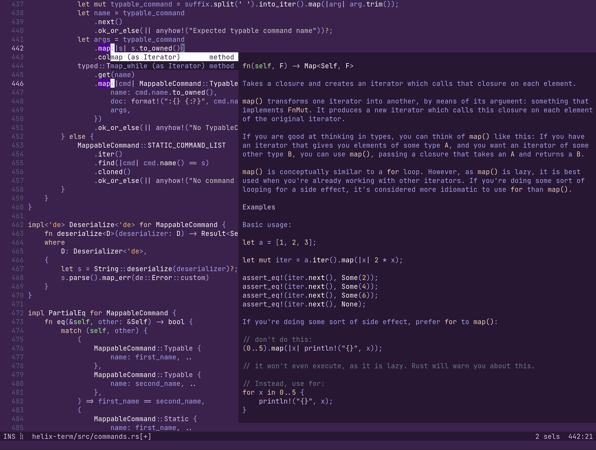

# Helix
> This is for ***users*** only. If you are interested in contributing, have a look at [CONTRIBUTING.md](./CONTRIBUTING.md). If you have a doubt, consider asking it in [discussions](https://github.com/helix-editor/helix/discussions) or [Matrix Space](https://matrix.to/#/#helix-community:matrix.org)(Matrix Space is more active).


[](https://github.com/helix-editor/helix/actions)



A kakoune / neovim inspired editor, written in Rust.

The editing model is very heavily based on kakoune; during development I found
myself agreeing with most of kakoune's design decisions.

For more information, see the [website](https://helix-editor.com) or
[documentation](https://docs.helix-editor.com/).

All shortcuts/keymaps can be found [in the documentation on the website](https://docs.helix-editor.com/keymap.html)

# Features

- Vim-like modal editing
- Multiple selections
- Built-in language server support
- Smart, incremental syntax highlighting and code editing via tree-sitter

It's a terminal-based editor first, but I'd like to explore a custom renderer
(similar to emacs) in wgpu or skulpin.

# Installation

Note: Only certain languages have indentation definitions at the moment. Check
`runtime/<lang>/` for `indents.toml`.

We provide packaging for various distributions, but here's a quick method to
build from source.

```
git clone --recurse-submodules --shallow-submodules -j8 https://github.com/helix-editor/helix
cd helix
cargo install --path helix-term
```

This will install the `hx` binary to `$HOME/.cargo/bin`.

Helix also needs it's runtime files so make sure to copy/symlink the `runtime/` directory into the
config directory (for example `~/.config/helix/runtime` on Linux/macOS). This location can be overriden
via the `HELIX_RUNTIME` environment variable.

Packages already solve this for you by wrapping the `hx` binary with a wrapper
that sets the variable to the install dir.

> NOTE: running via cargo also doesn't require setting explicit `HELIX_RUNTIME` path, it will automatically
> detect the `runtime` directory in the project root.

Alternatively, if you want to embed the `runtime/` directory into the Helix binary you can build
it with:

```
cargo install --path helix-term --features "embed_runtime"
```

[](https://repology.org/project/helix/versions)

## MacOS
Helix can be installed on MacOS through homebrew via:

```
brew tap helix-editor/helix
brew install helix
```
 
# Contributing
Please see [CONTRIBUTING.md](./CONTRIBUTING.md).

# Getting help

Discuss the project on the community [Matrix Space](https://matrix.to/#/#helix-community:matrix.org) (make sure to join `#helix-editor:matrix.org` if you're on a client that doesn't support Matrix Spaces yet).
